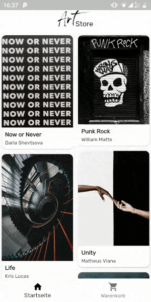
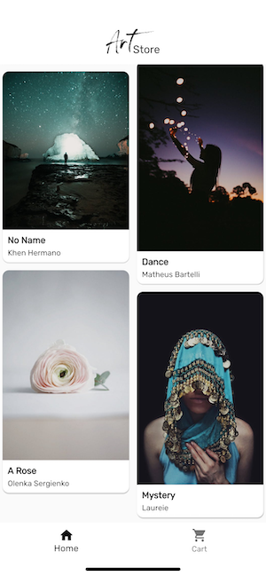
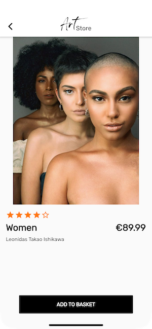
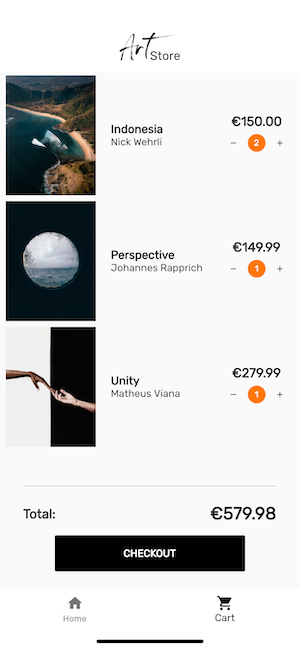

# art_store

An app built using Flutter where the user can buy artworks.

Design inspired in part by [Art store app - light mode](https://dribbble.com/shots/7144232-Art-store-app-light-mode) by [Rogier Welling](https://dribbble.com/rogierwelling).

[Font Arthure](https://www.dafont.com/arthure.font) by Khurasan. 

Images taken from [pexels.com](https://www.pexels.com/). All prices and image titles are made up, author names represent image uploaders.

## Screenshots

|                       |                              |                              |                              |
|-----------------------| ---------------------------- | ---------------------------- | ---------------------------- |
|  |  |  |  |

## Technical Info

- The app consists of the screens `MainScreen` and `ProductDetailScreen`.
- `MainScreen` has a BottomNavigationBar containing `HomeScreen` and `ShoppingCartScreen`.
    - On `HomeScreen`, the user can select an artwork and is taken to `ProductDetailScreen`.
    - On `ShoppingCartScreen` the user can checkout their selected products.
- `ProductDetailScreen` shows info about a selected artwork, while the user can add the product to their shopping cart.
- A SQLite database is used to store all details about each product.
- `Provider` is used for dependency injection.
- `MobX` is used as the project's state management solution.
- The app is localized and internationalized into English and German.
    - This project uses `flappy_translator` to generate a i18n localization file from CSV using the command `flutter pub run flappy_translator`.
